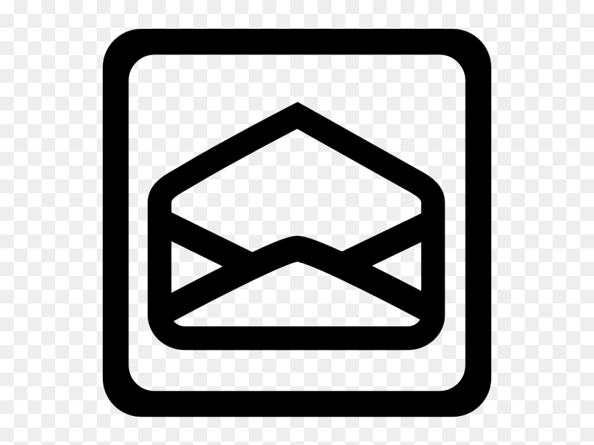

# Maziar Gomrokchi      &nbsp;&nbsp; &nbsp;&nbsp;

[About](about) | [Projects](projects) | [Research](research) | [Awards](awards) | [Hobbies](hobbies)

  
 
## About
  I am a final year of PhD. student at <a href="http://rl.cs.mcgill.ca//">Reasoning and Learning Lab</a> at <a href="https://www.mcgill.ca//">McGill</a> and at <a href="https://mila.quebec/en/">Mila</a> working with <a href="http://rl.cs.mcgill.ca/people/doina-precup/">Doina Precup</a>.

My broad research domains are machine learning, reinforcement learning and data privacy. My current reserach focus is on developing privacy-preserving machine learning systems. My goal is to design and develope privacy-aware machine learning algorithms that serve as the main core of AI systems. 

During my studies, I designed and developed the first generation of privacy-preserving reinforcement learning (RL) algorithms. I also developed the first membersbership infrence attacked against off-policy RL systems.
  
## Projects

**TBA.**

## Research

- Exploration in RL
- Privacy-Preserving RL
- MIA against off-policy deep RL models

## Awards

- [billmei.net](https://billmei.net/)
- [bawejakunal.github.io](https://bawejakunal.github.io/)
- [case2111.github.io](https://case2111.github.io/)
- [karateca.org](https://www.karateca.org/)

## Hobbies
  
  
